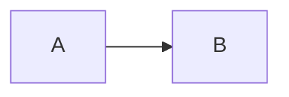

# 報告に貼る識別子は、そのまま使える形で書く

ユーザーへの報告にコミットハッシュや URL を書くときは、**受け取った側がコピーやクリックでそのまま使える形**にしてください。
これは全プロジェクト共通の規約です。

## コミットハッシュ: レンジではなく個々のハッシュを列挙する

`<old>..<new>` のレンジ形式は使わず、**今回作成した個々のコミットハッシュをそのまま列挙**します。

```markdown
## Push 完了

- `314c13312 refactor(order): BulkUpdate エラーラップの規約準拠化`
- `9388e541c refactor(order): bulkUpdateOrderRow doc の内部実装詳細除去`
```

単発なら `Push しました: 461dbb81d` の1行でよく、subject の併記があるとより親切です。

禁止: `Push 完了 (25fd5105d..461dbb81d)` のようなレンジ表記、「N コミット」と件数だけ添えてハッシュを省くこと。

なぜ: レンジ `A..B` は「A の次から B まで」なので `A` は含まれず、表記から件数が読み取れないうえ `A` を含むと誤読されます。ユーザーがレビューや追跡で使うのは個別のハッシュ（GitHub UI、`git show <hash>`、レビュー返信への引用）なので、レンジだと `git log A..B` を叩く手間が発生します。

## PR / issue を対象にした報告には、毎回 URL を添える

ユーザーは報告を読んだ後、その PR を自分で開きに行きます。番号だけ（ `#420` ）ではターミナルでリンクにならないので、URL をそのまま1本置く。

**「毎回」は文字どおりです。** 1つの PR に対して報告が続くとき、2回目以降を省かない。

| 省きたくなる場面 | それでも添える理由 |
| --- | --- |
| 直前の報告に貼った | ユーザーは最後の報告だけを見ている。遡らせない |
| 投稿ではなく修正・点検・調査だった | 対象が同じ PR なら、確認しに行く動機も同じ |
| 会話が長くなり、URL が何度も並ぶ | 並ぶことの負担より、探させることの負担のほうが大きい |

### 個々のコメントの URL まで出す

**PR の URL だけだと、開いた後に該当箇所を探すことになります。** コメント単位で動いたなら、その1件へ直接飛べる URL を添える。

| 報告するもの | 添える URL |
| --- | --- |
| レビューを投稿した | PR の URL と、インライン1件ずつの URL |
| 特定のコメントへ対応した / 返信した | そのコメントの URL |
| PR 全体の状態を報告した | PR の URL |

GitHub API はコメントごとに `html_url` を返すので、投稿結果を確認するときに一緒に拾えます。件数が多ければ表の1列にする。

なぜ: 報告は「何が起きたか」を伝えるだけでなく、ユーザーが自分で確かめる入口でもあります。入口が無いと、番号から URL を組み立てるか、前の報告まで遡ることになる。コメント単位の URL は、その入口を「探さずに着く」ところまで詰めるものです。

## URL: 直後に括弧書きや句読点を続けない

ターミナルの URL 検出は**空白か行末までを1つの URL** と見なすため、直後に文字を続けるとリンクが壊れます。

```
PR: https://github.com/owner/repo/pull/392（draft）   ← （draft）まで URL に含まれる
run: https://github.com/owner/repo/actions/runs/123 は success。   ← 「。」が含まれる
```

全角・半角を問わず括弧は URL 文字として扱われうるので、半角に変えても解決しません。補足を前に置くか、Markdown link にするか、表のセルに分ける。URL は行末で終わらせるのが最も安全です。

```
PR を作成しました: https://github.com/owner/repo/pull/392
[#392](https://github.com/owner/repo/pull/392) にレビューが 2 件付いています
```

**そもそも自明なラベルを添えない。** `（draft）` `（open）` のような状態は、リンクを開けば分かります。判断に必要だとユーザーが示した場合を除き、書かないほうが URL も報告文も短くなります。

なぜ: 報告に URL を書くのは「クリックして飛べるようにする」ためで、飛べない URL は貼っていないのと同じです。

## レビュー対応の一覧: Conversation の並び順に合わせる

PR のレビューコメントへの対応を報告するときは、GitHub の Conversation タブで見たときと同じ順に並べます。人間・AI のどちらのレビューでも同じです。

- 優先度（ `[must]` を先に）や対応可否で並べ替えない。取得順が Conversation の順なので、`gh api repos/OWNER/REPO/pulls/<PR>/comments` が返す `created_at` 昇順をそのまま維持すれば合います
- **対応したものと対応しなかったものを別の表に分けない。** 1つの表に混ぜ、結果の列で書き分けます。分けた時点で並びが崩れます
- 列は「コメント ID / 種別 / 位置 / 指摘の要約 / 結果」。結果にはコミットハッシュか非対応の理由を入れ、長い根拠は表の下に回します

なぜ: 受け取った側は PR を開いて上から順に返信していく。並びが違うと1件ごとに表の中を探し直すことになり、件数が増えるほどコストが積み上がります。一覧を出すのは突き合わせを楽にするためなので、並べ替えるとその目的自体が失われます。

## コードを指すときは `file:line` で書く

ターミナルでは `file_path:line_number` がクリックできます。ファイル名だけ・関数名だけでは開けないので、行まで書く。

```markdown
<!-- ❌ NG: 読み手が探すことになる -->
`buildSummary` に項目の一覧があります
`handler.go` の変換処理を直しました

<!-- ✅ OK: そのまま開ける -->
`internal/application/service/report/build.go:190` に項目の一覧があります
`internal/adapter/controller/handler.go:154` を直しました
```

- 範囲を指すなら起点と終点を出す（ `build.go:190` 〜 `:270` ）。節や関数のまとまりで読ませたいとき
- 行数の多いファイルほど効く。400行のファイルで「〜という関数がある」と書かれると、読み手は grep から始めることになる
- 要点だけに付ける。全部の言及に行番号を足すと、地の文が識別子で埋まって読めなくなる

**GitHub へ書く文章では使いません。** 差分が動いて別の行を指すため、あちらはパーマリンク（ `/format-github-post` ）。同じ `path:line` が、会話では正解で GitHub では禁止という関係です。

## Mermaid のフェンスの書き方と、描画の限界

開きに `mermaid` を付け、末尾を閉じます。タグがあると貼り先がコードブロックとして扱うのでハイライトが効き（Notion 等）、閉じを落とすと後続の文章まで飲まれます。使うかどうかの判断は `concise_first_then_detail.md` が持ちます。

TUI は描画に成功するとソースを捨てて図だけにするので、3バッククォートで書いただけでは原文が残りません。**図とソースの両方を出します。**

| 書くもの | 囲み | 何が出るか |
| --- | --- | --- |
| 1つ目 | 3バッククォートの `mermaid` フェンス | 図。TUI が置き換える |
| 2つ目（同じソース） | 情報文字列を付けない4バッククォートで、3バッククォートの `mermaid` フェンスを中に入れる | ソース。描画されずに残る |

4バッククォート側に `mermaid` と書いてはいけません。判定は開いたフェンスの情報文字列を見るので、そこに書くと外側が描画対象になり、2つとも図になります（実際に踏みました）。外側は空にします。

`````
````

````
`````

出す順は図が先、ソースが後です。読み手は図を見に来ており、怪しいときだけ原文を読みます。

ソースを残すのは、描画が発展途上だからです。線が別のノードを貫通するなどの癖があり（後述）、図だけを出すと読み手が誤りを確かめられません。原文があれば、図と突き合わせて判断できます。

4バッククォートで囲んだほうは `mermaid` タグごとコピーできるので、読み手が Notion や GitHub へ貼れば、そちらの描画器で描き直せます。

図が1つも要らないなら、ソースだけで構いません。両方出すのは、図を主張の根拠に使うときです。

描画結果を見てから出します。構文が通っても、意図した形になるとは限りません（ `concise_first_then_detail.md` の「描画結果を見る」）。実測で分かっている癖は次の5つです。

| 癖 | 実測 | 重さ |
| --- | --- | --- |
| 交差する辺が畳まれる | 2対2で引いた4本が2本の横線になり、どれがどこへつながるか判読できない | 最も重い |
| 線が別のノードを貫通する | `修正中 --> レビュー中` の線がマージ済みの箱を横切り、出どころがマージ済みに見えた | 中 |
| 幅が足りないと図が出ない | `not rendered: wider than N columns` の1行が返る。折り返しはしない | 軽い |
| 対応外の種類は落ちる | `gantt` は `not rendered: unsupported diagram type`。黙って壊れない | 軽い |
| `subgraph` は横並びになる | 前と後の対比は別のブロックに分ける（ `concise_first_then_detail.md` ） | 軽い |

**下3つは気づけますが、上2つは正しい絵に見えます。** そのため、描画結果を見る必要があります。

種類で強さが違います。

| 種類 | 出来 |
| --- | --- |
| `sequenceDiagram` | 最も強い。`loop` / `alt` / `else` / `Note` まで描く |
| `classDiagram` | 強い。`o--` を ◇、`..>` を破線で描き分ける |
| `flowchart` / `stateDiagram-v2` | 分岐は得意、交差と合流が弱い |
| `erDiagram` | 分岐を持たせても縦の鎖になる |

辺が交差する構造は図にせず、表か箇条書きに置き換えます。図にできるのは木に近い形だけだと考えてください。

## 例外

- ユーザーが「レンジで教えて」等と明示指示した場合はそれに従う
- 作業完了ログとして "前 head → 現 head" の遷移を示したいときは、レンジではなく `Before: <old> / After: <new>` のような明示ラベルで表現する
- 100+ コミットを一気に push した等、列挙が現実的でないケースでは件数 + 代表ハッシュ数個 + 「詳細は `git log <old>..<new>` 」の案内で妥協してよい

## 関連

- `decide_or_ask.md` （自分で決めるか尋ねるか）と対で使う。指示で走った作業の報告フォーマット部分を本ルールが担う
- `summarize_after_each_task.md` （各作業後にサマリを添える）と併用: サマリ内で識別子を示す場合も本ルールに従う
- `github_cross_repo_reference.md` （GitHub 上で他リポジトリの PR / issue を参照する書式）: あちらは GitHub へ書く文章、本ルールはユーザーへの報告が対象
- `/format-github-post` （投稿する文章の畳み方）: `path:line` の扱いが逆になる。会話ではクリックできるので使い、GitHub では差分が動くので使わない
- `concise_first_then_detail.md` （簡潔に）: Mermaid と表を使うかどうかの判断はあちら。本ルールは会話へ出すときの書式だけを定める
- `base_records_on_measurements.md` （記録は実測に基づける）: 本ルールは会話での報告の書式、あちらは後から引かれる文書の確かさ。会話で出した推定を、そのまま記録へ写さない
- `/explain-code` （実装を噛み砕いて説明する）: 本ルールが土台で、あちらは読む順の案内を上乗せする
- `/review-pr` / `/update-pr-description`: どちらも「GitHub が ```mermaid をレンダリングする」を持つが、あちらは投稿先の話。本ルールは会話へ出すときの書式
- `wrap_values_in_inline_code.md` （値と識別子は囲む）: **会話と GitHub で扱いが逆になる**。会話では囲んで値として示し、GitHub では囲むと自動リンクが消える（コミット SHA も同じ）
- `/resolve-ai-reviews` / `/resolve-human-reviews` （レビュー対応スキル）: 対応表の並び順と列構成は本ルールに従う
